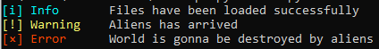
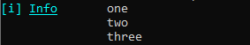
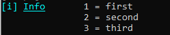
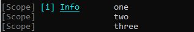
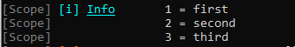

<div align="center">

<h1>Salem</h1>
<h4>A highly configurable logger written entirely in C# and .Net Standard 2.0</h4>
<h5>(more about the supported platforms below)</h5>

[](https://forthebadge.com)
[](https://forthebadge.com)

</div>

<div align="center">


</div>

## Status:

| Branch | Build | Tests | Code Quality |
|--------|-------|-------|--------------|
| Master |  |  |  |
|  Dev   |        | |     |

## Supported platforms:

* .Net Core 2.0 and above
* .Net Framework 4.6.1 and above
* Mono 5.4 and above
* Xamarin.iOS 10.14 and above
* Xamarin.Mac 3.8 and above
* Xamarin.Android 8.0 and above
* UWP 10.0.16299 and above
*  2018.1 and above

## Usage

### The simplest usage

```csharp
using Salem;

var logger = new Logger();

//The first parameter - log level (for example: info, warning or error) (Not case-sensitive)
//The second parameter - our message (string or any object)
//The third parameter - scope (no need to specify if the same as scope in the constructor or empty)
logger.Log("Info", "Files have been loaded successfully");
logger.Log("Warning", "Aliens have arrived");
logger.Log("Error", "World is going to be destroyed by the aliens");
```



### Formatters

#### Lists and dictionaries

<details>

<summary>Without a scope</summary>

```csharp
using Salem;
using System.Collections.Generic;

var logger = new Logger();
var list = new List<string>() { "one", "two", "three" };

logger.Log("info", list);
```



```csharp
using Salem;
using System.Collections.Generic;

var logger = new Logger();
var dict = new Dictionary<string, string>() { { "1", "first" }, { "2", "second" }, { "3", "third" } };

logger.Log("info", dict);
```



</details>

<details>

<summary>With a scope</summary>

```csharp
using Salem;
using System.Collections.Generic;

var logger = new Logger("Scope");
var list = new List<string>() { "one", "two", "three" };

logger.Log("info", list);
```



```csharp
using Salem;
using System.Collections.Generic;

var logger = new Logger("Scope");
var dict = new Dictionary<string, string>() { { "1", "first" }, { "2", "second" }, { "3", "third" } };

logger.Log("info", dict);
```


	
</details>
